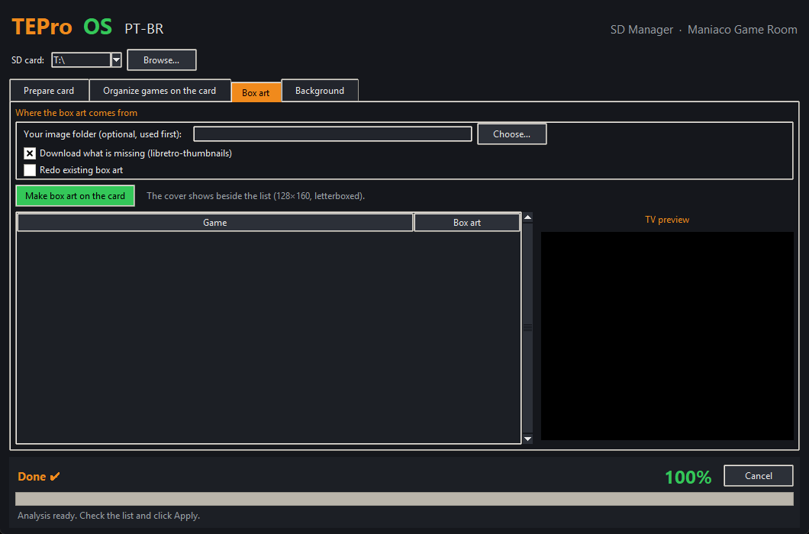

# TEPro OS — SD Manager: user manual

**[Versão em português](MANUAL.md)**

The SD Manager gets your **Turbo EverDrive PRO** card ready for the PC Engine / TurboGrafx-16 in a few clicks: it installs the **TEPro OS** menu (Portuguese or English), organizes and fixes your games, makes the box art, writes ready-made cheats, changes the menu background and copies the CD BIOS.

A **[Maniaco Game Room](https://www.maniacogameroom.com.br/)** project. The app window can be shown in English or Portuguese (**Idioma / Language** menu); this manual uses the English labels.

---

## Contents

1. [Before you start](#1-before-you-start)
2. [The app window](#2-the-app-window)
3. [Prepare card](#3-prepare-card)
4. [Organize games on the card](#4-organize-games-on-the-card)
5. [Box art](#5-box-art)
6. [Background](#6-background)
7. [On the console](#7-on-the-console)
8. [What goes where on the card](#8-what-goes-where-on-the-card)
9. [Troubleshooting](#9-troubleshooting)
10. [Credits](#10-credits)

---

## 1. Before you start

**You need:**

- An original **Turbo EverDrive PRO** by Krikzz. Generic "Turbo EverDrive" carts sold on online marketplaces run a different system and **cannot** use the TEPro OS menu (see [section 9](#9-troubleshooting)).
- A PC with **Windows 10 or 11**.
- A **microSD card formatted as FAT32** (cards up to 32 GB come that way; bigger cards must be formatted as FAT32).
- **Internet** the first time: the app downloads Krikzz's official firmware, the box art and the cheats. Everything is cached on the PC afterwards.

**Installation:** none. Download `TEPro-OS-Gerenciador.exe` from the [Releases](../../releases) page and run it.

> The first time, Windows may show "Windows protected your PC" (SmartScreen), because the program is new and has no paid signature. Click **More info → Run anyway**.

**Your card is safe:** the app **never deletes anything**. Replaced system files go to `edturbo/backup/<date>`, duplicate games go to the `_duplicados` folder, and the game organization can be undone.

---

## 2. The app window

- **SD card** (top): pick the card's drive letter. The app suggests cards that have an `edturbo` folder; use **Browse…** otherwise.
- **Tabs:** Prepare card, Organize games on the card, Box art and Background.
- **Footer:** current step, percentage, time left and the **Cancel** button.
- **File** menu: open the card in Explorer.
- **Idioma / Language** menu: the whole window in English or Portuguese. The first time, the app follows the Windows language.
- **Theme** menu: window colours (Night, Light, PC Engine, TurboGrafx-16, CRT screen). Your choice is saved.
- **Help** menu: Maniaco Game Room blog, Krikzz's official site and About.

---

## 3. Prepare card

The main tab: tick what you want and click **Prepare card**. Each step can run on its own (for example only step 4, to add cheats to a card that is already set up).

### Step 1 — Install the TEPro OS menu

- Pick the menu language: **Portuguese (TEPro OS PT-BR)** or **English (TEPro OS, original texts)** (Krikzz's original English texts). Both have the same features (box art, header with the flag, battery voltage).
- The app downloads the official firmware **v26.0923** from krikzz.com, checks its signature (SHA-256), builds the menu on your PC and writes it to the card.
- **Already have the official `.efu`?** Point to it in the optional field and nothing is downloaded.
- Your saves (`edturbo/gamedata`), BIOS and current theme are kept.
- The official themes, already adjusted, go to the **`Temas`** folder at the card root.
- To **switch language** later, run step 1 again with the other language.

### Step 2 — Copy the games from a PC folder

- Point to the folder with your games (`.pce`, `.sgx`, `.cue` with its `.bin` files, and `.zip`).
- Each ROM is **identified by its content** (No-Intro and Redump databases), gets its official name and is copied already organized, following the **How to organize the games** options (see [section 4](#4-organize-games-on-the-card)).
- **US ROMs with reversed bits** (white screen on the EverDrive) are written already fixed.
- The app checks the free space first and skips what is already on the card.

### Step 3 — Make the box art

Creates each game's cover, shown beside the list in the menu. Uses your own image folder first (Box art tab), then the libretro-thumbnails collection.

### Step 4 — Ready-made cheats

- Writes each game's cheats (HuCard, SuperGrafx and CD images) in the menu's format, with the most common descriptions in Portuguese ("Vidas infinitas" = infinite lives, "Invencível" = invincible, "Energia infinita" = infinite energy…).
- **They all start off.** You turn on the ones you want on the console ([section 7](#7-on-the-console)).
- A game's own existing cheats are kept.
- **+ "Cheats CD" folder for real discs:** one file per CD game in the `Cheats CD` folder inside the system folder (`edturbo`), hidden from the game list, to use with an **original disc** (see [section 7](#cheats-with-a-real-cd)).

### Step 5 — CD BIOS (System Card)

- Point to the BIOS file you own (the BIOS is **not** shipped with the app). Krikzz recommends the Japanese **Super CD-ROM System v3.0**.
- The app copies it to `edturbo/bios` and fixes a bit-reversed US dump by itself.
- The path is remembered for next time.

At the end, the text box shows a **report** of everything that was done.

---

## 4. Organize games on the card

Tidies up the games **already on the card**.

1. Choose the options:
   - **Full name** (`1943 Kai (Japan)`) or **Short name** (`1943 Kai`);
   - **Folders:** keep the current ones, by letter, by region (Japao, EUA = USA, Europa, Mundo = World, Coreia = Korea, Outros = Others) or by region and letter;
   - **Move duplicate versions to `_duplicados`**: keep only the best copy of each game and region;
   - **Keep hacks and trainers** and **Keep translations**.
2. Click **1) Analyze the card**. The list shows what will happen to each file:
   - **Rename** — renamed to the official name and/or moved;
   - **Already right** — nothing changes;
   - **Move to _duplicados** — duplicate copy;
   - **Fix ROM (USA)** — bit-reversed US dump that will be fixed.
3. Check it and click **2) Apply**.
4. Changed your mind? **Undo the last organization** puts everything back, including the fixed ROMs.

Saves, cheats and box art follow a renamed game. BIOS files (`[BIOS]…`) are never touched.

---

## 5. Box art

- **Your image folder** (optional): your own PNG/JPG covers named after the game. They come first.
- **Download what is missing**: from libretro-thumbnails.
- **Redo existing box art**: rewrites every cover.
- Click **Make box art on the card**. Click a game in the list for a **TV preview**.

The cover sits beside the list (128×160 pixels, letterboxed, never stretched).

---

## 6. Background

Turns any image into the menu background.

1. **Choose…** the image. It fills the screen (320×224); the overflow is cropped.
2. Pick the mode:
   - **Rich: up to ~100 colours** (recommended) — best for photos and colourful art;
   - **Simple: 16 colours** — like Krikzz's official tool; tick **Dithering** to smooth gradients.
3. **Darken:** makes the image darker so the list text is easy to read.
4. The **preview** shows the list and the cover area on top.
5. **Write to card**. The previous background goes to `edturbo/backup`, and a copy of the new one goes to the **`Temas`** folder as `Fundo <name>`.
6. Don't like it? **Restore the previous background**.

Power the console off and on to see the new background.

---

## 7. On the console

Menu controls: **D-pad** moves, **I** opens / file menu, **II** goes back, **SELECT** opens the Main Menu (Menu Principal), **RUN** runs the last game.

### Turning cheats on

1. Select the game in the list and press **I → Cheats** (or **Menu Principal → Cheats** for the last selected game).
2. Turn each code on/off with **Left/Right**.
3. **Opções → Cheats** (Options → Cheats) must be on.

Keep few cheats on at once: each one takes a little of the console's CPU time.

### Cheats with a real CD

To play with an **original disc** (for example on a Turbo Duo):

1. **Menu Principal → Pasta do Sistema** (System Folder) **→ `bios`** and select the **Super System Card** (just select it, don't run it).
2. Still in the **System Folder**, open **`Cheats CD`**, select your game's file and press **I → Carregar Cheats** (Load Cheats).
3. In **Cheats**, turn on the codes you want.
4. With the disc in the console, run the Super System Card and boot the disc.

### Changing the theme

Open the **`Temas`** folder, select a theme and press **I → Usar este Tema** (Set Theme).

### Choosing the CD BIOS

With more than one BIOS in `edturbo/bios`, the menu uses the first one in the list. To pick another: **Pasta do Sistema → `bios`**, select the BIOS and **I → Usar como BIOS** (Set Bios).

### Cartridge information

**Menu Principal → Informações** shows the firmware version, games played and the clock **battery voltage** (BATERIA, in hundredths of a volt: `0300` = 3.00 V; very low values mean the CR2032 cell needs replacing).

---

## 8. What goes where on the card

| Folder / file | What it is |
|---|---|
| `edturbo/menu.dat` | The TEPro OS menu |
| `edturbo/capas/` | Box art (`.cap`) |
| `edturbo/gamedata/<game>/` | Each game's saves and cheats |
| `edturbo/bios/` | CD BIOS (System Card) |
| `edturbo/sysdata/theme.bgr` | Current theme / background |
| `edturbo/backup/<date>/` | Copies of everything the app replaced |
| `edturbo/organizador-desfazer.json` | Undo log of the organizer |
| `Temas/` | Themes and backgrounds to pick on the console |
| `edturbo/Cheats CD/` | Cheats for real discs |
| `HUCARD/`, `CD/` | Your games, organized |
| `_duplicados/` | Duplicate copies (delete them if you like) |

---

## 9. Troubleshooting

| Problem | Fix |
|---|---|
| "The card is formatted as exFAT/NTFS" | The EverDrive only reads **FAT32**. Format the card as FAT32 (erases it) and prepare it again. |
| A US game shows a **white screen** | It is a bit-reversed dump. Run **Organize games on the card** and apply the **Fix ROM (USA)** lines. |
| A game has no cover | Its name was not recognized. Put an image named after the game in your image folder (Box art tab) and make the covers again. |
| No internet | Use the official `.efu` you already have (step 1) and your image folder (covers). Cheats and game databases need internet the first time. |
| I want the original menu back | Copy the `menu.dat` kept in `edturbo/backup/<date>/` back to `edturbo/`, or install the official firmware from Krikzz's site. |
| CD images don't run on a Turbo Duo | A hardware limitation of the Duo with the EverDrive. Original discs work normally. |
| Generic "Turbo EverDrive" cart | These clones run a different system stored in the cart itself: the TEPro OS menu, box art, cheats and themes do not work on them. |
| Krikzz releases new firmware | The app keeps using v26.0923, the tested one. A new app version will bring support for the new firmware. |

Found a bug? Open an [Issue](../../issues) with a screenshot and the app's report.

---

## 10. Credits

- **Turbo EverDrive PRO, original firmware and menu:** Igor Golubovskiy (**Krikzz**) — [krikzz.com](https://krikzz.com). The official firmware is downloaded from his site and adapted on your PC; nothing by Krikzz is distributed by this project.
- **Box art:** [libretro-thumbnails](https://github.com/libretro-thumbnails).
- **Cheats and game databases (No-Intro / Redump):** [libretro-database](https://github.com/libretro/libretro-database).
- **TEPro OS and SD Manager:** © 2026 Maniaco Game Room. All rights reserved. See the [license](LICENCA.md).
