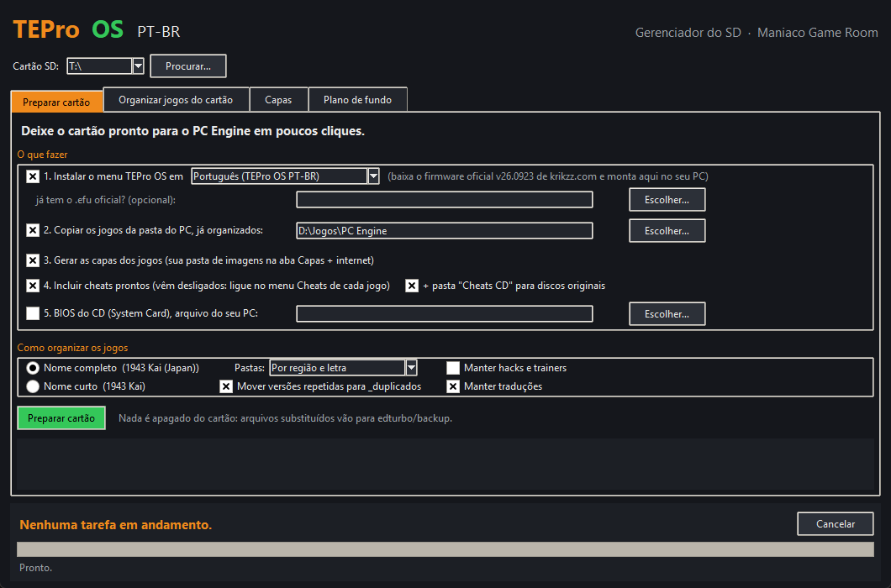
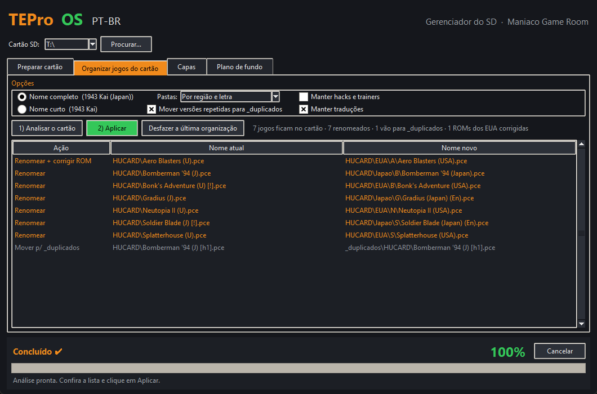
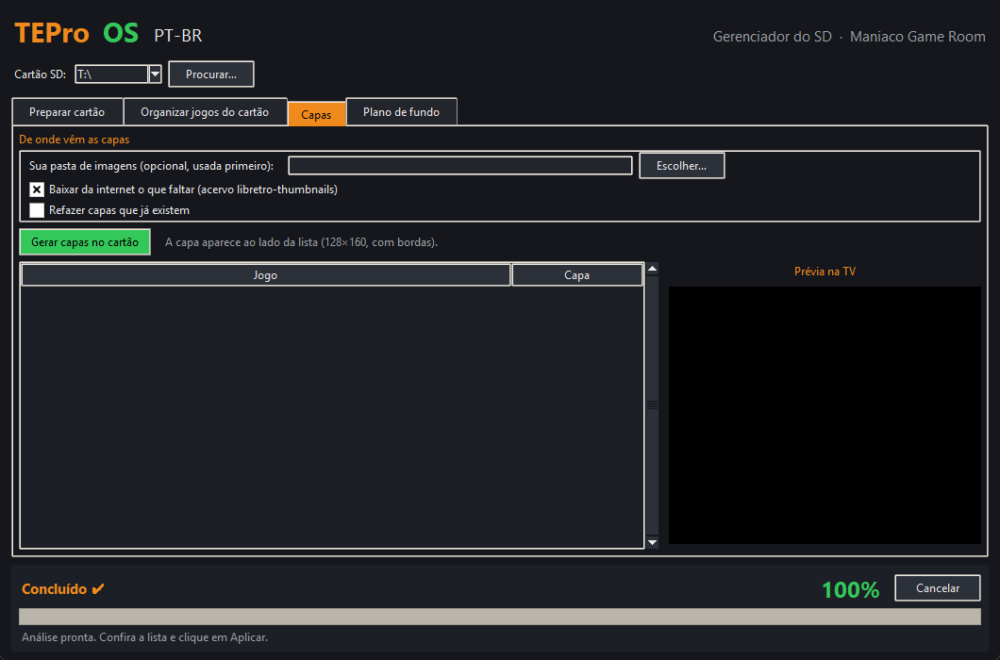
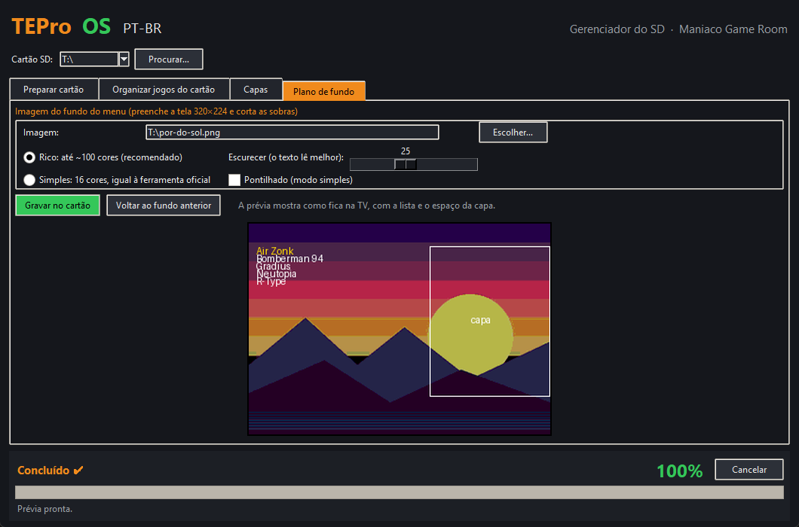

# Manual do TEPro OS — Gerenciador do SD

**[English version](MANUAL.en.md)**

O Gerenciador do SD deixa o cartão do seu **Turbo EverDrive PRO** pronto para o PC Engine / TurboGrafx-16 em poucos cliques: instala o menu **TEPro OS** (em português ou inglês), organiza e corrige os jogos, gera as capas, grava cheats prontos, troca o plano de fundo do menu e copia a BIOS do CD.

Um projeto do blog **[Maniaco Game Room](https://www.maniacogameroom.com.br/)**.

---

## Sumário

1. [Antes de começar](#1-antes-de-começar)
2. [A janela do aplicativo](#2-a-janela-do-aplicativo)
3. [Preparar cartão](#3-preparar-cartão)
4. [Organizar jogos do cartão](#4-organizar-jogos-do-cartão)
5. [Capas](#5-capas)
6. [Plano de fundo](#6-plano-de-fundo)
7. [No console](#7-no-console)
8. [O que fica em cada pasta do cartão](#8-o-que-fica-em-cada-pasta-do-cartão)
9. [Problemas e soluções](#9-problemas-e-soluções)
10. [Créditos](#10-créditos)

---

## 1. Antes de começar

**Você precisa de:**

- Um **Turbo EverDrive PRO** original da Krikzz. Os cartuchos "Turbo EverDrive" genéricos vendidos em lojas on-line usam outro sistema e **não** recebem o menu TEPro OS (veja a [seção 9](#9-problemas-e-soluções)).
- Um computador com **Windows 10 ou 11**.
- Um **cartão microSD formatado em FAT32** (até 32 GB vem assim de fábrica; cartões maiores precisam ser formatados em FAT32).
- **Internet** na primeira vez: o aplicativo baixa o firmware oficial do site da Krikzz, as capas e os cheats. Depois fica tudo guardado no PC.

**Instalação:** não há instalação. Baixe o `TEPro-OS-Gerenciador.exe` na página de [Releases](../../releases) e abra.

> Na primeira vez, o Windows pode mostrar "O Windows protegeu o computador" (SmartScreen), porque o programa é novo e não tem assinatura paga. Clique em **Mais informações → Executar assim mesmo**.

**Seu cartão está seguro:** o aplicativo **não apaga nada**. Arquivos de sistema substituídos vão para `edturbo/backup/<data>`, jogos repetidos vão para a pasta `_duplicados`, e a organização dos jogos pode ser desfeita.

---

## 2. A janela do aplicativo

- **Cartão SD** (topo): escolha a letra do cartão. O aplicativo já sugere os cartões que têm a pasta `edturbo`. Use **Procurar…** se o cartão não aparecer.
- **Abas:** Preparar cartão, Organizar jogos do cartão, Capas e Plano de fundo.
- **Rodapé:** mostra a etapa atual, a porcentagem, o tempo que falta e o botão **Cancelar**.
- **Menu Arquivo:** abre o cartão no Explorer.
- **Menu Idioma / Language:** mostra a janela inteira em português ou em inglês. Na primeira vez, o aplicativo usa o idioma do Windows.
- **Menu Tema:** muda as cores da janela (Noite, Claro, PC Engine, TurboGrafx-16 e Tela CRT). A escolha fica salva.
- **Menu Ajuda:** blog Maniaco Game Room, site oficial da Krikzz e Sobre.

---

## 3. Preparar cartão

É a aba principal: marque o que quer fazer e clique em **Preparar cartão**. Cada passo pode ser feito sozinho (por exemplo, só o passo 4 para adicionar cheats a um cartão que já está pronto).

### Passo 1 — Instalar o menu TEPro OS

- Escolha o idioma: **Português (TEPro OS PT-BR)** ou **English (TEPro OS, textos originais)**. Os dois têm os mesmos recursos (capas, cabeçalho com a bandeira, tensão da bateria).
- O aplicativo baixa o firmware oficial **v26.0923** de krikzz.com, confere a assinatura (SHA-256), monta o menu no seu PC e grava no cartão.
- **Já tem o `.efu` oficial?** Aponte o arquivo no campo opcional e o aplicativo não precisa baixar.
- Seus saves (`edturbo/gamedata`), a BIOS e o tema que você usa são mantidos.
- Os temas oficiais, já adaptados, vão para a pasta **`Temas`** na raiz do cartão.
- Para **trocar de idioma** depois, rode de novo só o passo 1 com o outro idioma.

### Passo 2 — Copiar os jogos da pasta do PC

- Aponte a pasta onde estão seus jogos no PC (`.pce`, `.sgx`, `.cue` com os `.bin`, e também `.zip`).
- Cada ROM é **identificada pelo conteúdo** (bancos No-Intro e Redump), recebe o nome oficial e é copiada já organizada, conforme as opções de **Como organizar os jogos** (veja a [seção 4](#4-organizar-jogos-do-cartão)).
- **ROMs americanas com os bits invertidos** (davam tela branca no EverDrive) são gravadas já corrigidas.
- O aplicativo confere se cabe no cartão antes de copiar e pula o que já está lá.

### Passo 3 — Gerar as capas

Cria a capa de cada jogo, que aparece ao lado da lista no menu. Usa primeiro a sua pasta de imagens (aba Capas) e depois o acervo libretro-thumbnails.

### Passo 4 — Incluir cheats prontos

- Grava os cheats de cada jogo (HuCard, SuperGrafx e imagens de CD) no formato do menu. As descrições mais comuns vêm em português ("Vidas infinitas", "Invencível", "Energia infinita"…).
- **Todos vêm desligados.** Você liga os que quiser no console (veja a [seção 7](#7-no-console)).
- Se um jogo já tem os seus próprios cheats, eles são mantidos.
- **+ pasta "Cheats CD" para discos originais:** cria a pasta `Cheats CD` dentro da pasta de sistema (`edturbo`), escondida da lista de jogos, com um arquivo por jogo de CD, para usar com o **CD original** no console (passo a passo na [seção 7](#cheats-com-cd-original)).

### Passo 5 — BIOS do CD (System Card)

- Aponte o arquivo da BIOS que você tem (a BIOS **não** vem com o aplicativo). A Krikzz recomenda a japonesa **Super CD-ROM System v3.0**.
- O aplicativo copia para `edturbo/bios` e corrige sozinho um dump americano com os bits invertidos.
- O caminho fica lembrado para a próxima vez.

Ao final, a caixa de texto mostra o **relatório** de tudo o que foi feito.

---

## 4. Organizar jogos do cartão

Arruma os jogos que **já estão no cartão**.

1. Escolha as opções:
   - **Nome completo** (`1943 Kai (Japan)`) ou **Nome curto** (`1943 Kai`);
   - **Pastas:** manter as atuais, por letra (A, B, C…), por região (Japao, EUA, Europa, Mundo, Coreia, Outros) ou por região e letra;
   - **Mover versões repetidas para `_duplicados`:** deixa só a melhor cópia de cada jogo e região;
   - **Manter hacks e trainers** e **Manter traduções**.
2. Clique em **1) Analisar o cartão**. A lista mostra o que vai acontecer com cada arquivo:
   - **Renomear** — ganha o nome oficial e/ou vai para outra pasta;
   - **Já está certo** — nada muda;
   - **Mover p/ _duplicados** — cópia repetida;
   - **Corrigir ROM (EUA)** — dump americano com os bits invertidos que será corrigido.
3. Confira e clique em **2) Aplicar**.
4. Mudou de ideia? **Desfazer a última organização** devolve tudo como estava, inclusive as ROMs corrigidas.

Saves, cheats e capas acompanham o jogo quando ele é renomeado. Arquivos de BIOS (`[BIOS]…`) nunca são mexidos.

---

## 5. Capas

- **Sua pasta de imagens (opcional):** capas próprias em PNG/JPG, com o nome do jogo. Têm prioridade.
- **Baixar da internet o que faltar:** acervo libretro-thumbnails.
- **Refazer capas que já existem:** regrava todas.
- Clique em **Gerar capas no cartão**. Clique num jogo da lista para ver a **prévia de como fica na TV**.

A capa fica ao lado da lista (128×160 pixels, com bordas, sem distorcer a imagem).

---

## 6. Plano de fundo

Transforma qualquer imagem no fundo do menu.

1. **Escolher…** a imagem. Ela preenche a tela (320×224) e as sobras das bordas são cortadas.
2. Escolha o modo:
   - **Rico: até ~100 cores** (recomendado) — melhor para fotos e artes coloridas;
   - **Simples: 16 cores** — igual à ferramenta oficial da Krikzz; marque **Pontilhado** para suavizar degradês.
3. **Escurecer:** deixa a imagem mais escura para o texto da lista ficar legível.
4. A **prévia** mostra a lista e o espaço da capa por cima.
5. **Gravar no cartão.** O fundo anterior vai para `edturbo/backup`, e uma cópia do novo fica na pasta **`Temas`** como `Fundo <nome>`.
6. Não gostou? **Voltar ao fundo anterior.**

Desligue e ligue o console para ver o novo fundo.

---

## 7. No console

Controles do menu: **Direcional** move, **I** abre / menu do arquivo, **II** volta, **SELECT** abre o Menu Principal, **RUN** roda o último jogo.

### Ligar cheats

1. Selecione o jogo na lista e aperte **I → Cheats** (ou **Menu Principal → Cheats** para o último jogo selecionado).
2. Ligue/desligue cada código com **Esquerda/Direita**.
3. A opção **Opções → Cheats** precisa estar ligada.

Use poucos cheats ao mesmo tempo: cada um usa um pouco do processamento do console.

### Cheats com CD original

Para jogar com **disco original** (por exemplo, num Turbo Duo):

1. **Menu Principal → Pasta do Sistema → `bios`** e selecione a **Super System Card** (só selecione, sem rodar).
2. Ainda na **Pasta do Sistema**, entre em **`Cheats CD`**, selecione o arquivo do seu jogo e aperte **I → Carregar Cheats**.
3. Em **Cheats**, ligue os códigos que quiser.
4. Com o disco no console, rode a Super System Card e dê boot no disco.

### Trocar de tema

Entre na pasta **`Temas`**, selecione um tema, aperte **I → Usar este Tema**.

### Escolher a BIOS do CD

Se houver mais de uma BIOS em `edturbo/bios`, o menu usa a primeira da lista. Para escolher outra: **Pasta do Sistema → `bios`**, selecione a BIOS e **I → Usar como BIOS**.

### Informações do cartucho

**Menu Principal → Informações** mostra a versão do firmware, os jogos jogados e a **tensão da bateria** do relógio (campo BATERIA, em centésimos de volt: `0300` = 3,00 V; valores muito baixos indicam que a pilha CR2032 precisa ser trocada).

---

## 8. O que fica em cada pasta do cartão

| Pasta / arquivo | O que é |
|---|---|
| `edturbo/menu.dat` | O menu TEPro OS |
| `edturbo/capas/` | As capas dos jogos (`.cap`) |
| `edturbo/gamedata/<jogo>/` | Saves e cheats de cada jogo |
| `edturbo/bios/` | BIOS do CD (System Card) |
| `edturbo/sysdata/theme.bgr` | O tema / plano de fundo em uso |
| `edturbo/backup/<data>/` | Cópias de tudo o que o aplicativo substituiu |
| `edturbo/organizador-desfazer.json` | Registro para desfazer a organização |
| `Temas/` | Temas e fundos para escolher no console |
| `edturbo/Cheats CD/` | Cheats para discos originais |
| `HUCARD/`, `CD/` | Seus jogos, organizados |
| `_duplicados/` | Cópias repetidas (pode apagar se quiser) |

---

## 9. Problemas e soluções

| Problema | Solução |
|---|---|
| "O cartão está em exFAT/NTFS" | O EverDrive só lê **FAT32**. Formate o cartão em FAT32 (apaga tudo) e prepare de novo. |
| Jogo americano abre com **tela branca** | É um dump com os bits invertidos. Rode **Organizar jogos do cartão** e aplique as linhas **Corrigir ROM (EUA)**. |
| Jogo sem capa | O nome não foi reconhecido. Coloque uma imagem com o nome do jogo na sua pasta de imagens (aba Capas) e gere de novo. |
| Sem internet | Use o `.efu` oficial que você já tem (passo 1) e sua pasta de imagens (capas). Cheats e bancos de jogos precisam de internet na primeira vez. |
| Quero o menu original de volta | Copie o `menu.dat` guardado em `edturbo/backup/<data>/` para `edturbo/`, ou instale o firmware oficial pelo site da Krikzz. |
| Imagens de CD não rodam num Turbo Duo | Limitação do hardware do Duo com o EverDrive. Discos originais funcionam normalmente. |
| Cartucho "Turbo EverDrive" genérico | Esses clones usam outro sistema, gravado no próprio cartucho: o menu TEPro OS, capas, cheats e temas não funcionam neles. |
| Quando a Krikzz lançar um firmware novo | O aplicativo continua usando a versão v26.0923, que é a testada. Uma nova versão do aplicativo trará suporte ao firmware novo. |

Achou um erro? Abra uma [Issue](../../issues) com o print da tela e o relatório do aplicativo.

---

## 10. Créditos

- **Turbo EverDrive PRO, firmware e menu originais:** Igor Golubovskiy (**Krikzz**) — [krikzz.com](https://krikzz.com). O firmware oficial é baixado do site dele e adaptado no seu PC; nada da Krikzz é distribuído por este projeto.
- **Capas:** [libretro-thumbnails](https://github.com/libretro-thumbnails).
- **Cheats e bancos de jogos (No-Intro / Redump):** [libretro-database](https://github.com/libretro/libretro-database).
- **TEPro OS e Gerenciador do SD:** © 2026 Maniaco Game Room. Todos os direitos reservados. Veja a [licença](LICENCA.md).
