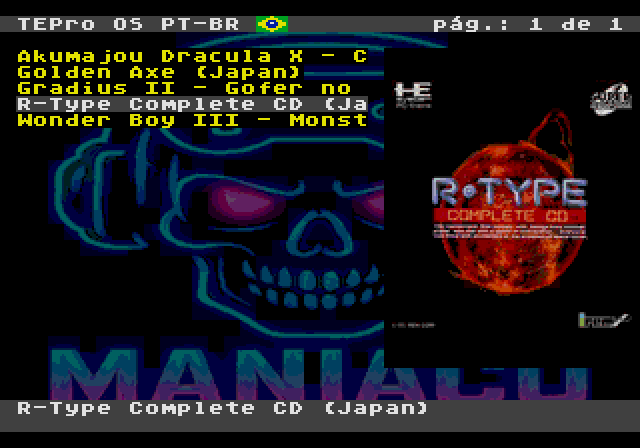
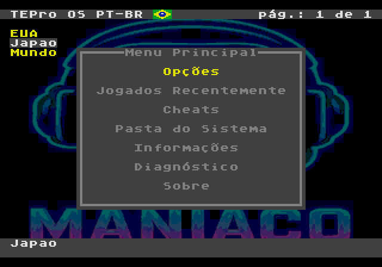
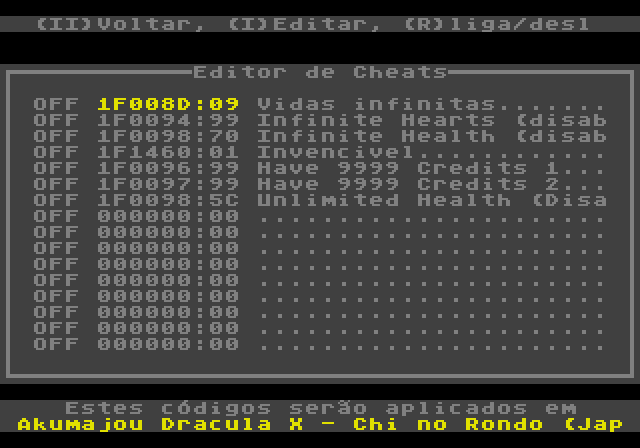
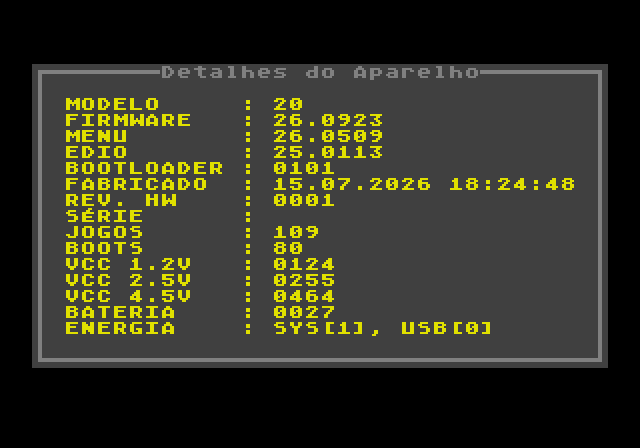
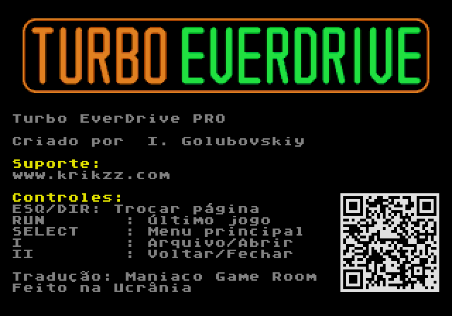
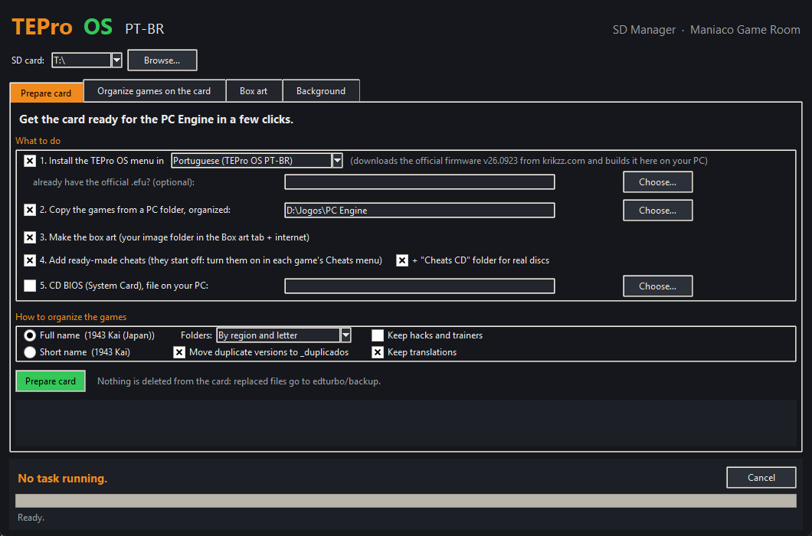
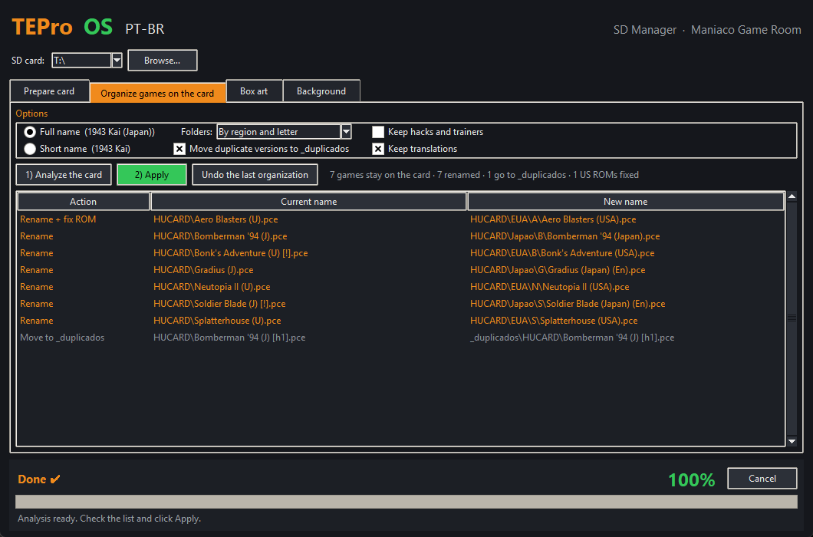
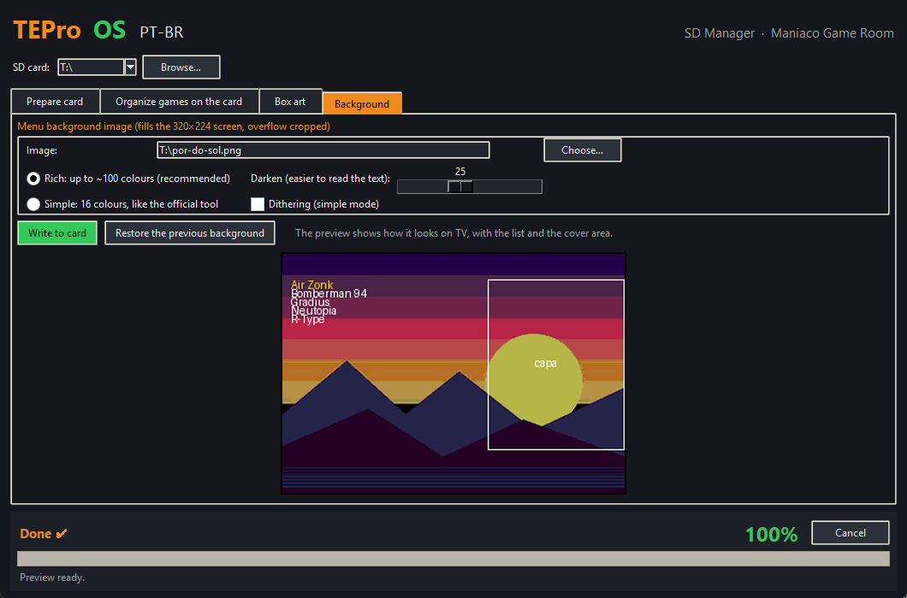

# TEPro OS

**[Português](README.md)**

**A Brazilian Portuguese menu for the Turbo EverDrive PRO (PC Engine / TurboGrafx-16), with game box art, ready-made cheats and custom backgrounds — plus an app that gets the SD card ready in a few clicks.**

A **[Maniaco Game Room](https://www.maniacogameroom.com.br/)** project.

## What TEPro OS brings

| | |
|---|---|
|  |  |
|  |  |

- **The whole menu in Portuguese**, with accented characters. Also available with Krikzz's original English texts.
- **Box art** for each game beside the list.
- **Header** with the TEPro OS name and the Brazilian flag; page number on the right.
- **Clean list:** no file extensions (`.pce`, `.sgx`, `.cue`).
- **Ready-made cheats** for hundreds of HuCard and CD games, including **real CDs** (tested on a Turbo Duo).
- **Custom background** from any image, and **themes** you can switch on the console.
- Clock **battery voltage** on the details screen.

## The app: SD Manager

With the card in your PC, a few clicks:

1. installs the TEPro OS menu (downloads the official firmware from Krikzz's site and adapts it on your PC);
2. copies your games, including from `.zip`, with their **official names**, sorted by **region and letter**;
3. **fixes US ROMs** that gave a white screen;
4. makes the **box art**;
5. writes the **cheats**;
6. copies the **CD BIOS** you own.

The app runs in **English or Portuguese** (Idioma / Language menu). It can also tidy up a card that is already set up and change the menu background. **Nothing is deleted:** everything replaced goes to a backup folder, and the organization can be undone.

| | |
|---|---|
|  |  |

## How to use

1. Download **`TEPro-OS-Gerenciador.exe`** from the **[Releases](../../releases)** page.
2. Put the EverDrive card in your PC (formatted as **FAT32**).
3. Open the app, pick the card and click **Prepare card**.
4. Put the card back in the EverDrive and power on the console.

Full step-by-step guide with every option: **[App manual](MANUAL.en.md)**.

## Requirements

- An original **Turbo EverDrive PRO** by Krikzz (firmware v26.0923). Generic "Turbo EverDrive" carts sold on online marketplaces run a different system and are **not** compatible.
- Windows 10 or 11.
- A FAT32 microSD card.
- Internet the first time (firmware, box art and cheats are downloaded and cached on the PC).

## Notice

TEPro OS **does not distribute Krikzz's firmware**: the app downloads the official file from [krikzz.com](https://krikzz.com) and applies the changes on your computer. The Turbo EverDrive PRO, its firmware and original menu belong to Igor Golubovskiy (Krikzz). This project is not affiliated with Krikzz. ROMs and BIOS files are not provided.

## Credits

- Turbo EverDrive PRO and original firmware: **Krikzz** — [krikzz.com](https://krikzz.com)
- Box art: [libretro-thumbnails](https://github.com/libretro-thumbnails)
- Cheats and game databases (No-Intro / Redump): [libretro-database](https://github.com/libretro/libretro-database)

## License

**Freeware — free to use. © 2026 Maniaco Game Room. All rights reserved.** See the [license](LICENCA.md) and the [third-party components](TERCEIROS.md).

Found a problem? Open an [Issue](../../issues).
